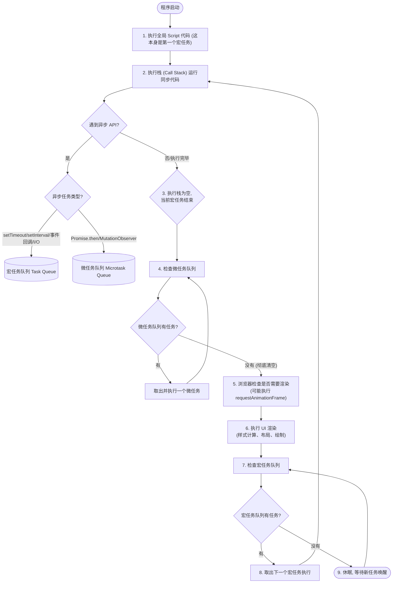

- 宏任务: script(整体代码)、setTimeout、setInterval、UI交互事件、postMessage、Ajax
- 微任务: Promise .then catch finally、MutaionObserver、process.nextTick(Node.js 环境)

```mermaid
graph TD
    Start([程序启动]) --> InitialTask["1. 执行全局 Script 代码 (这本身是第一个宏任务)"]
    InitialTask --> CallStack["2. 执行栈 (Call Stack) 运行同步代码"]

    CallStack --> Encounter{遇到异步 API?}
    Encounter -- 是 --> Distribute{异步任务类型?}
    Encounter -- "否/执行完毕" --> MicroCheck

    Distribute -- "setTimeout/setInterval/事件回调/I/O" --> MacroQueue[("宏任务队列 Task Queue")]
    Distribute -- "Promise.then/MutationObserver" --> MicroQueue[("微任务队列 Microtask Queue")]

    MicroCheck{"3. 执行栈为空, <br>当前宏任务结束"} --> CheckMicro["4. 检查微任务队列"]

    CheckMicro --> HasMicro{"微任务队列有任务?"}
    HasMicro -- 有 --> RunMicro["取出并执行一个微任务"]
    RunMicro --> CheckMicro
    HasMicro -- "没有 (彻底清空)" --> CheckRender

    CheckRender["5. 浏览器检查是否需要渲染<br>(可能执行 requestAnimationFrame)"] --> Render["6. 执行 UI 渲染<br>(样式计算、布局、绘制)"]

    Render --> CheckMacro["7. 检查宏任务队列"]
    CheckMacro --> HasMacro{"宏任务队列有任务?"}
    HasMacro -- 有 --> TakeMacro["8. 取出下一个宏任务执行"]
    TakeMacro --> CallStack
    HasMacro -- 没有 --> Sleep(["9. 休眠, 等待新任务唤醒"])
    Sleep --> CheckMacro
```